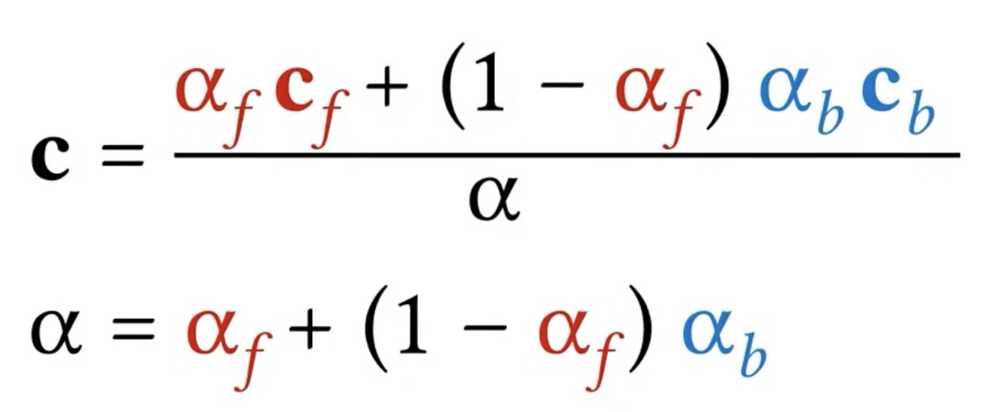

# Project 01 Alpha blending

The two main components of this project are: 
1. work with srgb image data
2. implement an alpha blending 

## SRGB image data

The srgb image data (`ImageData.data: Uint8ClampedArray`) comes in a single flat array of (r,g,b,a) values. Each value is 8 bits (2^8 = 0-255, since we start at 0). 

The tricky aspect of this algorithm is working with a 1D array within 2D space. `fgPos` provided the starting (x,y) coordinates (top left corner) of the foreground image, from which we can iterate through the foreground image  in a row/column fashion offsetting the index by 4, since rgba.
```javascript
    for(let y = 0; y < fgHeight; y++){
        for(let x = 0; x < fgWidth; x++){
            const foregroundIndex = (y * fgWidth + x) * 4;
            const backgroundIndex = ((y + startY) * bgWidth + x + startX) * 4;

            const bgX = x + startX;
            const bgY = y + startY;
            
            if (bgX >= 0 && bgX < bgWidth && bgY >= 0 && bgY < bgHeight) {
                for(var k = 0; k < 3; k++){
                    // compute alpha
                }
            }
        }
    }
```


## Alpha blending



For alpha blending, we simply mix the foreground opacity with the foreground alpha, then calculate the alpha blend (α in the image above). 

```javascript
    const blendAlpha = fgOpacity + (1 - fgOpacity) * bgOpacity;

    const blendedChannel = (cf * fgOpacity + cb * (1 - fgOpacity)) / blendAlpha;
```

Since working with 8 bit integers, first we need to normalize the incoming srgb alpha value, and ensure we round the resulting value (floats aren't supported).


## Links:
* [Course Files](https://graphics.cs.utah.edu/courses/cs4600/fall2020/?prj=1)
* [Compositing Digital images](https://graphics.pixar.com/library/Compositing/paper.pdf) original paper. 