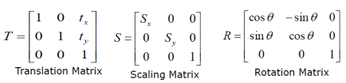

# Project 02 - 2D Transformations

(Note, the background doesn't seem to load in FireFox, currently working in Chrome.)

The two main components of this project are: 
1. Understanding which elements of the 3x3 homogeneous matrix apply to Translate, Rotate, and Scale
2. Applying one transformation onto another.  

## 2D transformation Matrix

The `GetTransform` is intended to return the various components of a transformation matrix in a single colum-major Array format.



These matrices once applied, result in a single 2D transformation matrix:

```
| (Sx * cosθ)   -sinθ        Tx|
| sinθ        (Sy* cosθ)     Ty|
| 0             0             1|
```

## Transformation Application

The second method `ApplyTransform` is a relatively simple method to implement. The biggest thing is to keep track of your indices. 


## Links:
* [Course Files](https://graphics.cs.utah.edu/courses/cs4600/fall2020/?prj=2)
